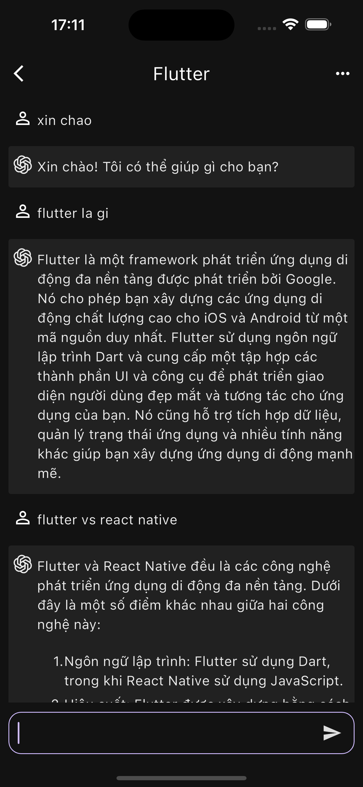
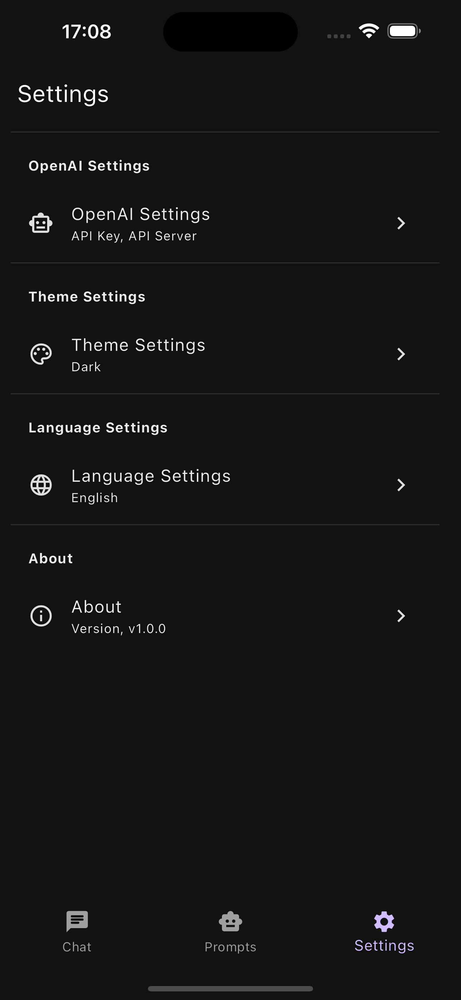
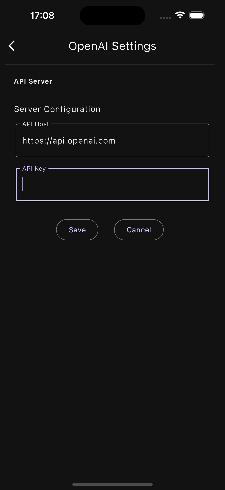

# ONE CHAT

## Introduction

An simple AI Chat application built with Flutter. 
This app uses the [OpenAI API](https://beta.openai.com/docs/introduction) to chat with GPT-3.5 and GPT-4.
Google Bard and Google Gemini will be added soon.

## Features

- [x] Chat with GPT-3.5
- [x] Chat with GPT-4
- [ ] Chat with Google Bard
- [ ] Chat with Google Gemini
- [x] Helpful prompts to get you started
- [x] Chat sessions
- [x] Edit the chat session options (temperature, count, model, etc.)
- [x] Dark/Light theme
- [x] Multiple Language

## Tech Stack

I used the following main framework and libraries to build this app:

- [Flutter](https://flutter.dev/) for building the app
- [dart_openai](https://pub.dev/packages/dart_openai) for OpenAI API requests and responses
- [GetX](https://pub.dev/packages/get) for state management, dependency injection, and route management
- [Dio](https://pub.dev/packages/dio) for HTTP requests
- [Isar](https://pub.dev/packages/isar) for local database, save chat sessions and settings (including API key)
- [RxDart](https://pub.dev/packages/rxdart) for reactive programming
- [flutter_dotenv](https://pub.dev/packages/flutter_dotenv) for environment variables
- [flutter_localizations](https://pub.dev/packages/flutter_localizations) for internationalization
- [flutter_launcher_icons](https://pub.dev/packages/flutter_launcher_icons) for app icons

## Build and Run

```bash
# Clone the repo
git clone https://github.com/vanhung4499/one_chat
# Go to the project root directory
cd one_chat
# Install dependencies
flutter pub get
# Run the app
flutter run
```

## Project Structure

```bash
lib
├── app_routes.dart  # App routes
├── controllers      # GetX Controllers 
├── extensions       # Extensions
├── i18n             # Internationalization
├── main.dart        # Main entry point
├── models           # Models 
├── pages            # All pages in the app
├── repositories     # Repositories to handle data
├── services         # Services to handle http requests (APIs)
├── utils            # Utility functions
└── widgets          # Widgets used in pages
```

## Demo

### Video

- [Demo Video](https://drive.google.com/file/d/1gaBdeo54ZvZDqqwL7acVEmqFgCgD-D6s/view?usp=sharing)
  - Because of the size of the video, I cannot upload it to Youtube. Please watch it on Google Drive. Thanks!

### Screenshots

| Chat                                   | Settings                                           | OpenAI API Key                                              |
|----------------------------------------|----------------------------------------------------|-------------------------------------------------------------|
|  |  |  |

| Chat Sessions                          | New Chat                                           | Prompts                                                     |
|----------------------------------------|----------------------------------------------------|-------------------------------------------------------------|
|  |  |  |


## TODO

- Add more prompts
- Implement Google Bard and Google Gemini chat
- Implement image generation chat with DALL-E
- etc.

## References
- [OpenAI API](https://beta.openai.com/docs/introduction)
- [OpenAI API Playground](https://beta.openai.com/playground)
- [Flutter](https://flutter.dev/)
- [GetX](https://pub.dev/packages/get)
- [Dio](https://pub.dev/packages/dio)
- [Isar](https://pub.dev/packages/isar)
- [RxDart](https://pub.dev/packages/rxdart)
- [Dart OpenAI](https://pub.dev/packages/dart_openai)


